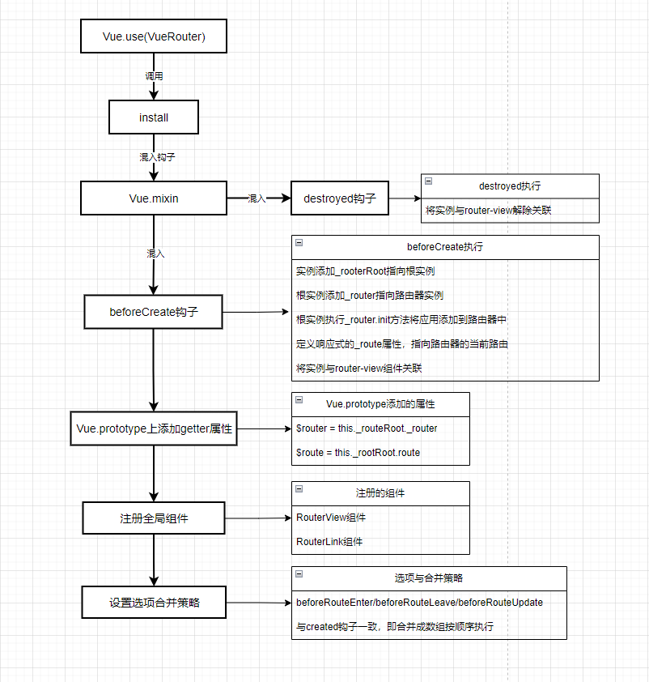
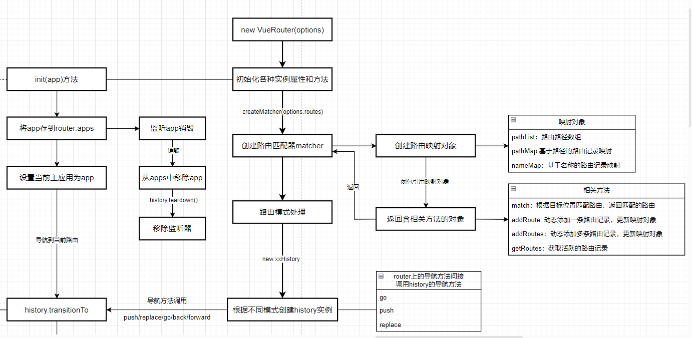
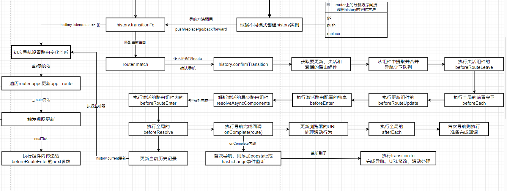
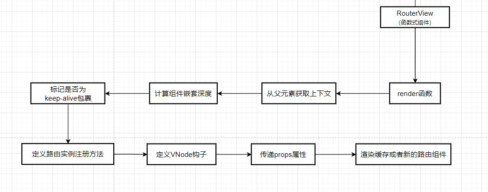
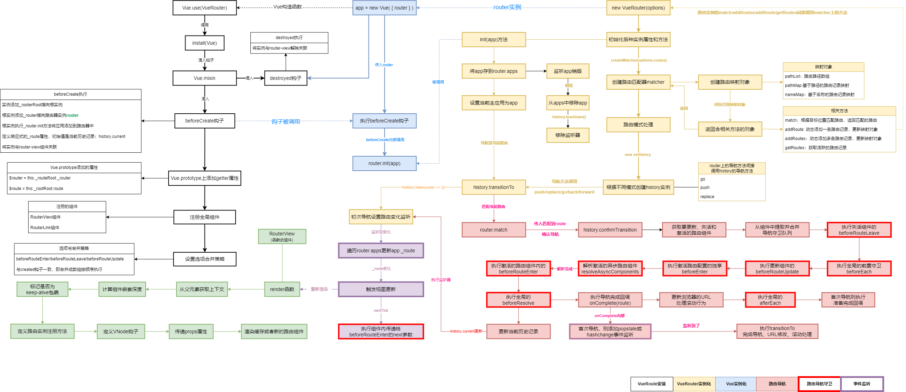

# VueRouter 3.6.5源码解读

## 开发环境启动

```bash
# 安装依赖
yarn

# 启动示例localhost:8080
yarn dev

```
目录下的`webpack.config.js`文件会配置导入包的路径别名，在`examples`目录下添加或修改示例代码就可以进行源码调试。

```js
// examples/webpack.config.js
module.exports = {
  resolve: {
    alias: {
      vue: 'vue/dist/vue.esm.js',
      'vue-router': path.join(__dirname, '..', 'src'), // 此处将vue-router的导入指向了src目录
      'vue-router/composables': path.join(__dirname, '..', 'src/composables')
    }
  },
}
```

## 目录结构

```bash
|-- components # 组件目录
|   |-- link.js # RouterLink组件
|   |-- view.js # RouterView组件
|-- composables # 组合式API(Vue3)
|-- create-matcher.js # 创建匹配器
|-- create-route-map.js # 创建路由映射表
|-- entries # 打包入口文件
|-- history # history模块
|   |-- abstract.js # 抽象history
|   |-- base.js # 基础history
|   |-- hash.js # hash模式history
|   |-- html5.js # history模式的history
|-- index.js # 根入口文件
|-- install.js # 安装函数
|-- router.js # VueRouter类
|-- util # 工具函数目录

```

## 几个类型和概念

在vue-router中，有几个核心的数据类型对于理解和使用Vue-Router至关重要，这些类型包括：`Route`、`RouteRecord`、`RouteConfig`和`Location`。

1. `Route`

`Route`是路由对象，表示路由的状态信息，平时使用时，像路由导航守卫接收的`from`、`to`以及通过`this.$route`访问到的`$route`都是`Route`类型。

```ts
interface Route {
  path: string
  name?: string | null
  hash: string
  query: Dictionary<string | (string | null)[]>
  params: Dictionary<string>
  fullPath: string
  matched: RouteRecord[]
  redirectedFrom?: string
  meta?: RouteMeta
}
```

2. `RouteConfig`

`RouteConfig`是路由配置对象的类型，每一条路由的配置就是一个`RouteConfig`对象。在实例化`Router`对象时，传入的`routes`参数就是`RouteConfig`对象的数组。

```ts
interface RouteConfig {
  path: string  // 路由路径
  name?: string // 路由名称
  component?: Component // 路由组件
  components?: { [name: string] : Component } // 命名视图组件
  children?: RouteConfig[] // 子路由
  redirect?: string | Location | Function // 路由重定向
  alias?: string | string[] // 路由别名
  meta?: any // 路由元信息
  props: boolean | Object | (route: Route) => Object | { [name: string]: boolean | Object } // 路由组件的props配置
  beforeEnter?: (to: Route, from: Route, next: Function) => void // 路由前置守卫
  caseSensitive?: boolean // 匹配规则是否区分大小写
  pathToRegexpOptions?: { sensitive?: boolean, strict?: boolean, end?: boolean} // 编译正则的选项
}
```

3. `RouteRecord`

路由记录，Vue-Router在实例化路由实例的时候，会根据传入的`routes`初始化路由记录，将路由记录转为各种映射对象（`pathList`，`nameMap`，`pathMap`）。其中`nameMap`，`pathMap`中存放的就是路由记录，它们实际上是格式化后的`routes`对象上的`RouteConfig`副本。在路由匹配记录（`this.$route.matched`）中，存放的就是路由记录数组。


```ts
interface RouteRecord {
  path: string // 路径
  regex: RegExp // 用于匹配路由的正则
  components: { [name: string]: Component } // 命名视图组件（component配置被格式化成 components.default）
  instances: { [name: string]: Vue } // 路由记录存放的组件实例，在执行路由导航守卫时会通过该对象获取组件实例提取组件内的守卫
  name?: string // 路由名称
  parent?: RouteRecord // 父级路由记录
  redirect?: string | Location | (to: Route => string | Location) // 重定向目标
  matchAs?: string // 别名路由真实匹配的路由记录的path
  meta: any // 路由记录的元信息
  beforeEnter?:  (to: Route, from: Route, next: Function) => void // 路由前置守卫
  props: boolean | Object | (route: Route) => Object | { [name: string]: boolean | Object } // 路由组件的props
}
```

4. `Location`

表示路由的位置信息对象，用于路由导航时作为目标对象，使用`router.push()`、`router.replace()`以及`route-link`组件传入的配置信息所指的就是`Location`类型的对象。

```ts
interface Location {
  name?: string // 路由名称
  path?: string // 路径
  hash?: string // 哈希值
  query?: { [name: string] : string | null} // 查询参数
  params?: Object // 路由参数
  append?: boolean // 是否追加到当前路由后面
  replace?: boolean // 是否替换当前路由
}
```

总结起来就是：

+ 路由配置时，传入的每条`route`是`RouteConfig`
+ 路由实例化，会格式化转换`RouteConfig`生成`RouteRecord`，路由匹配结果中的`matched`就是`RouteReCord`组成的数组
+ 路由匹配后，基于`RouteRecord`创建的结果就是`Route`类型，路由守卫的`to`、`from`以及`this.$route`都是`Route`类型
+ 路由导航时，使用的是`Location`类型的数据，**VueRouter**会根据传入的`Locaiton`进行匹配并执行相关处理

## VueRouter安装

**VueRouter**是一个**Vue**插件，在执行`Vue.use(VueRouter)`时，会自动执行`VueRouter.install`方法，并传入`Vue`实例作为参数安装插件。`install`方法的基本处理过程如下：

+ 标记成已安装（避免重复安装），将传入的`Vue`构造函数存储起来，与`VueRouter`关联，后续在`VueRouter`内部需要用的**Vue**构造函数都是通过该构造函数
+ 使用`Vue.mixin`全局混入`beforeCreate`和`destroyed`钩子
+ 在`Vue.prototype`上添加`$router`和`$route`getter属性，用于在组件中获取路由信息
+ 添加两个全局组件`RouterView`和`RouterLink`，分别用于渲染路由组件和生成路由导航链接
+ 通过`Vue.config.optionMergeStrategies`获取Vue的选项合并策略，并将`beforeRouteEnter`、`beforeRouteLeave`和`beforeRouteUpdate`合并策略设置为与`create`钩子一样的合并策略（默认是合并成数组并按顺序执行）

`beforeCreate`是路由实例化的核心，其处理流程如下（可以先阅读`VueRouter`实例化的过程再回头阅读这部分）：

+ 判断组件实例是否有`router`选项，如果有则认为是根路由组件（路由应用组件），做如下处理：
  + 在组件实例上添加`_routerRoot`属性指向当前实例
  + 在组件实例上添加`_router`属性指向传入的`router`实例
  + 执行`_router.init(this)`方法将当前实例传入作为应用（`app`）参数初始化路由，该方法执行后做如下处理：
    + 将当前实例添加到`router.apps`数组中（添加应用），并监听器`destroyed`的钩子，在应用销毁时从`router.apps`中移除，并更新主应用即其它销毁相关的操作
    + 如果还未设置主应用则将`router.app`设置为`app`
    + 通过`router.history`获取`History`实例，执行`history.transitionTo`方法进行导航过渡，导航成功后设置滚动行为并添加浏览器前进/后退事件监听器（`popstate`或`hashchange`）
    + 设置路由监听器，在路由变化时，遍历`router.apps`的应用列表，更新`app._route`属性，由于`_route`属性是响应式的，更新后会触发视图更新，从而触发`RouterView`组件的`render`方法，更新路由组件渲染
  + 使用`Vue.util.defineReactive`方法在组件实例上定义`_route`响应式属性（更新时会触发`RouterView`重新渲染），其初始值为`router.history.current`（即当前路由历史）。之后调用`registerInstance(this, this)`方法注册当前实例到路由中，其基本逻辑就是如果当前组件的父组件是`RouterView`组件，则调用`RouterView`组件实例的`data.registerRouteInstance`方法，将当前组件实例添加到匹配的路由`instances`属性当中
+ 如果组件实例没有`router`选项，则认为是非根路由组件，则在组件实例上添加`_routerRoot`属性，其值为`this.$parent._routerRoot`，即父组件的`_routerRoot`属性。由于Vue的运作机制机制是创建阶段是从父组件到子组件，挂在阶段是从子组件到父组件的顺序。所以当子组件的`beforeCreate`钩子执行时，父组件的`beforeCreate`钩子已经执行完毕，层层递进，所有子组件获取到的`_routerRoot`属性都是根路由组件定义的`_routerRoot`属性
+ 调用`registerInstance(this)`函数注册当前实例到路由中，将当前组件实例与`<router-view>`组件关联。



## VueRouter实例化与实例方法
 
调用`new VueRouter(options)`实例化`VueRouter`时，主要是初始化路由实例，添加一些实例属性和方法，并根据配置创建路由映射对象以及历史记录对象，其大致流程如下：

+ 实例化各种实例属性和方法
  + `app`：存放主应用
  + `apps`：存放所有的应用
  + `options`：路由配置
  + `mode`：路由模式
  + `fallback`：是否在不支持history模式时使用hash模式
  + `beforeHooks`： 全局前置守卫
  + `resolveHooks`：全局解析守卫
  + `afterHooks`：全局后置守卫
  + `matcher`：路由匹配器
  + `history`：历史记录实例
  + `currentRoute`：当前路由，是一个getter属性，返回`this.history.current`的值
+ 调用`createMatcher(options.routes)`创建router匹配器，并存储为实例属性`matcher`，用于路由匹配与动态添加路由。调用该函数后，会根据传入的`options.routes`创建`pathList`、`pathMap`、`nameMap`三个路由映射对象，分别路由存储路径、路径对应的路由记录（`RouteRecord`）、路由名称对应的路由记录，并返回一个包含以下属性用于管理这三个对象的对象：
  + `match`：路由匹配方法，用于根据给定的路由位置，获取路由匹配结果（`Route`）
  + `addRoute`：动态添加一条路由记录的方法，该方法闭包引用路由映射对象，执行后更新它们
  + `addRoutes`：与`addRoute`方法类似，用于动态添加多条路由记录
  + `getRoutes`：获取所有的路由记录
+ 处理路由模式，获取路由模式相关配置后，根据配置决定是否进行路由模式的回退处理
+ 根据路由模式创建相应的`History`实例，作为`history`实例属性的值

**VueRouter**实例有以下方法：

+ `init`：初始化路由，在根路由组件的`beforeCreate`钩子中调用，调用后会设置主应用、存储应用列表、添加应用销毁监听器、执行首次导航并设置浏览器导航事件监听以及路由更新的监听器
+ `match`：根据目标位置匹配路由记录，返回匹配的结果，其实际调用的是`this.matcher.match`方法
+ `resolve`：解析给定的目标位置，调用`this.match`获取匹配对象后返回一个包含`route`、`location`和`href`的格式化后的对象，通常用于在不执行实际导航的情况下（比如`router-link`组件的渲染）获取目标位置的路由信息
+ `addRoute`：添加新的路由记录，实际调用的是`this.matcher.addRoute`方法
+ `addRoutes`：添加新的路由记录数组，实际调用的是`this.matcher.addRoutes`方法
+ `getRoutes`：获取所有路由记录，实际调用的是`this.matcher.getRoutes`方法
+ `getMatchedComponents`：获取当前路由匹配的所有组件，获取到的是组件的构造函数而不是实例，通常用在服务端渲染的数据预加载时使用
+ `push`/`replace`/`go`/`back`/`forward`：路由导航API，实际调用的是`this.history.push`/`this.history.replace`以及`this.history.go`方法
+ `beforeEach`/`beforeResolve`/`afterEach`：分别用于注册全局的路由前置守卫、路由解析守卫以及路由后置守卫，以数组的方式分别存放在`beforeEachHooks`/`beforeResolveHooks`/`afterEachHooks`数组中，每次调用会返回一个用于移除该路由守卫的函数。
+ `onReady`： 实际调用的是`history.onReady`，注册路由初始导航完成和错误时的回调函数，多次注册会被处理成一个数组并按顺序执行
+ `onError`： 实际调用的是`history.onError`，注册路由导航过程中出现错误时的回调函数，多次注册会被处理成一个数组并按顺序执行



## 导航执行流程

在VueRouter中，路由的导航包含初始化时的初始导航、使用`RouterLink`组件导航以及编程式的导航（如`router.push`）、浏览器URL前进后退监听的导航。无论哪一种导航，其最终都是调用了`router.history`实例属性上的`transitionTo`方法执行导航，调用`router.history`实例属性上的`confirmTransition`方法确认导航。其大致的流程如下：

+ 执行`transitionTo`方法，首先根据传入的目标位置尝试调用`router.match`方法获取目标路由记录`route`，如果成功则执行下一步，否则，执行`onError`注册的错误回调函数，并则抛出错误。
+ 将`route`传入`confirmTransition`方法，确认导航执行：
  + 获取当前路由并与目标路由进行对比，如果相同则确保浏览器的地址正确并处理滚动，并创建一个重复导航的中断错误，导航中断
  + 根据当前路由和目标路由，提取失活的路由组件、激活的路由组件以及复用（更新）的路由组件
  + 创建路由导航守卫队列，按顺序分别提取失活组件的`beforeRouteLeave`、全局的路由前置守卫`beforeEach`、更新组件的更新守卫`beforeRouteUpdate`、激活组件的路由配置独享守卫`beforeRouteEnter`以及创建激活异步组件的解析守卫
  + 传入目标路由对象、当前路由对象和next函数，执行创建的守卫队列，执行期间会根据next函数的传值做相应的处理，如果期间发生错误，则抛出导航中断错误
  + 以上执行完后异步组件解析完毕，继续创建路由导航守卫队列，按顺序提取激活组件的内部的`beforeRouteEnter`守卫，获取全局的`beforeResolve`守卫
  + 执行获取到的守卫队列
  + 更新`_route`触发DOM更新
  + 执行导航完成的回调，并确保浏览器的地址正确
  + 执行全局的`afterEach`导航守卫
  + 如果是初次导航则执行由`onReady`注册的导航完成回调
  + DOM更新完成后(`nextTick`)，遍历匹配路由的`instances`组件实例，执行`beforeRouteEnter`守卫中，由next函数传入的回调函数

  

  ## RouterView组件

  `RouterView`组件是**VueRouter**的核心组件，它负责渲染当前活跃的路由对应的组件。`RouterView`组件是一个函数式组件，其基本的原理是`render`函数依赖了`_route`属性，在路由切换时，`_route`属性会更新，从而触发`render`函数的重新执行，从而渲染新的组件。`render`函数的基本逻辑如下：

  + 将组件的`data.routerView`属性标记成`true`，表示当前组件是`RouterView`组件，用于计算路由组件的层级
  + 获取组件的上下文，包括父组件的`$createElement`函数以及组件的名称等
  + 计算当前组件的层级，`RouterView`组件是支持嵌套路由的，通过不断的往上寻找父组件，每找到有`data.routerView`属性标记的，层级就加1，并将层级存储到`data.routerViewDepth`属性中
  + 在遍历获取父组件的过程，会判断组件是否被包裹在`keep-alive`标签中，如果是则会设置失活标记
  + 如果当前组件是`keep-alive`标签包裹的，则从缓存中获取组件，并传递`props`后渲染，否则指向下一步
  + 根据获取到层级，从匹配的路由数组中（`route.matched`）找到对应的路由配置，进而获取到对应的路由组件
  + 缓存获取到组件
  + 定义`data.registerRouteInstance`方法用于注册和移除应用组件实例，该方法在应用组件实例的`beforeCreate`和`destroyed`钩子被调用
  + 添加`init`和`prepatch`两个VNode钩子，保证当相同的组件在不同路由之间复用以及在keep-alive激活时，可以将实例添加到`matched.instances`中
  + 合并并传递`props`
  + 渲染组件

  


  ## 总结

  完整的基本流程如下：

  

    